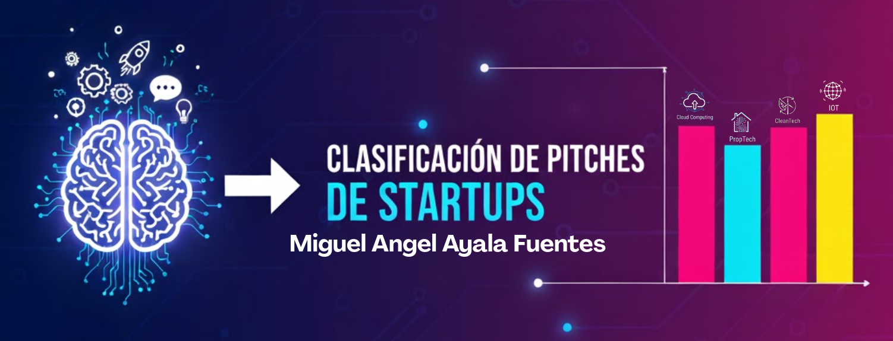

# Clasificación de Pitches de Startups

## Descripción
Proyecto que utiliza machine learning y deep learning para clasificar pitches de startups según su texto y atributos, empleando un dataset sintético. Incluye análisis exploratorio, limpieza de datos, vectorización, modelos clásicos y una red neuronal profunda.

## Tabla de contenidos
- Descripción
- Estructura del proyecto
- Uso
- Requerimientos
- Entregas

## Estructura del proyecto
├─ .venv 
├─ banner.png 
├─ proyecto.ipynb 
├─ pyproject.toml 
├─ README.md 
├─ startup_company_one_line_pitches.csv 
### Link al dataset
https://www.kaggle.com/datasets/pratyushpuri/startup-companies-one-line-pitches-2025

## Uso
1. Clona el repositorio:  
   `git clone https://github.com/mick2332-q/Clasificaci-n-de-Pitches-de-Startups.git`
2. Si no tienes `uv` instalado, instálalo con pip:  
   `pip install uv`  
   sigue la guía oficial en https://astral.sh/uv/install.sh para otras plataformas.
3. Crea un entorno virtual con uv:  
   `uv venv`
4. Instala dependencias con:  
   `uv sync`
5. Abre el notebook y ejecuta las celdas.

## Entregas
- **Entrega 1:** Análisis exploratorio (EDA) y limpieza de datos.
- **Entrega 2:** Vectorización y creación de modelos clásicos (Decision Tree, Random Forest, SVM).
- **Entrega 3:** DNN con TensorFlow/Keras y evaluación final.

## Autor
Miguel Angel Ayala Fuentes

